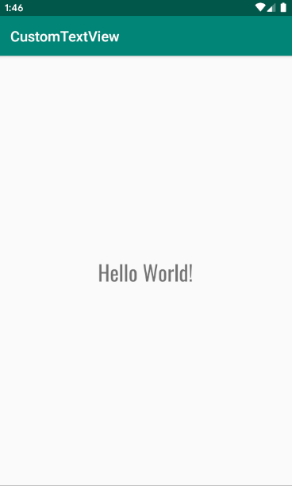

# CustomFontTextView

This is a custom TextView where one can use many fonts by using the **fontName** attribute.
More updates will be coming soon.




## Gradle

Inside root level gradle script:

```
allprojects {
	repositories {
			...
		maven { url 'https://jitpack.io' }
	}
}
```

Inside app level gradle script:

```
dependencies {
	implementation 'com.github.AshHasib:CustomFontTextView:0.1.0'
}
```


## Use

```
<code.ashhasib.customfonttextview.CustomTextView
            android:layout_width="wrap_content"
            android:layout_height="wrap_content"
            android:text="Hello World!"
            android:textColor="#000"
            android:textSize="40dp"
            app:fontName="montserrat_regular"
            app:layout_constraintBottom_toBottomOf="parent"
            app:layout_constraintLeft_toLeftOf="parent"
            app:layout_constraintRight_toRightOf="parent"
            app:layout_constraintTop_toTopOf="parent"/>
```


## Supported fonts

- Roboto
- DM serif
- Oswald
- Raleway
- Roboto Condensed
- Montserrat

More will be added later.

You can visit [My Site](https://ash-hasib.com/)  for relevant resources.